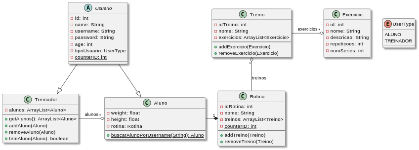

# GymBros - Projeto MC322

---

## Programação Orientada à Objetos
Junho de 2025

---

## Membros do Grupo

* Bruno Amaral Salles de Moraes - 281129
* Mateus Pachela Garcia - 259554
* Gabriel Mattias Antunes - 281199
* Isaias Junio Jarcem - 247042

---

## Introdução

O projeto final da disciplina MC322 é um sistema de gerenciamento e acompanhamento de fichas de treino e rotinas de exercício onde o usuário pode criar novas rotinas, editar/deletar rotinas existentes e alterar seu treino com os conceitos de Programação Orientada a Objetos. O projeto busca impactar, sobretudo, alunos de academias e/ou praticantes de atividades físicas individuais, dispensando o uso de fichas físicas de treino (muito usadas, ainda hoje, em academias) ou anotações em blocos de notas digitais e substituindo-as por um sistema unificado e simplificado.

O objetivo é facilitar a prática de exercícios físicos individuais, permitindo, também, a estruturação de rotinas direcionadas para usuários com necessidades específicas (por exemplo, indivíduos que buscam alcançar determinado nível de evolução na academia ou se preparam para provas/competições de corrida ou fisiculturismo). Além da parte voltada aos alunos, a aplicação também pode ser usada por treinadores/Professores de academias, onde é possível visualizar os alunos de um treinador, e, da mesma forma, editar os treinos dos alunos já existentes na base de dados. Essa edição, feita pelo treinador, se propaga para a visão do aluno.

O gerenciamento de arquivos e dados nessa aplicação é feito utilizando um conjunto de arquivos de texto que armazenam as informações do aluno e do professor, dispensando a necessidade de armazenar os objetos instanciados que representam cada aluno e professor e permitindo que, após a reinicialização da aplicação, seja possível visualizar as rotinas de exercícios dos usuários já cadastrados. Além disso, o sistema contém um sistema de login em que, ao acessar com um username já cadastrado, os dados associados à essa "conta" são recuperados pelo DataManager.

---

## Funcionalidades

* **[Sistema] Cadastro de um novo usuário:** Caso seja inserido um nome de aluno ou treinador não contido na base de dados, é possível cadastrar um novo usuário. Os dados são salvos em um arquivo de texto pelo DataManager.java.
* **[Sistema] Login de um usuário já existente:** Caso o usuário inserido já exista na base de dados, é possível acessar a conta do usuário.
* **[Sistema] Salvamento de dados adicionados/editados**
* **[Aluno] Adição de novos treinos**
* **[Aluno] Edição de treinos já existentes**
* **[Aluno] Adição de novos exercícios a um treino**
* **Remoção de exercícios/treinos**
* **[Aluno] Edição de um treino e/ou exercício já existente**
* **[Treinador] Adição/Edição de rotina de treinos de um usuário associado a um treinador**

---

## Estrutura de Classes

As classes e relações entre elas podem ser encontradas na pasta "Model" do código, e o diagrama de classes pode ser visto abaixo. A fim de simplificar a visualização do diagrama de classes, omitiu-se a presença dos métodos Getters e Setters.

*Diagrama UML de classes do Projeto*

Usuário é uma classe abstrata (isto é, não pode ser instanciada) que contém os atributos padrão para todos os usuários do sistema, como ID, nome, username, idade e tipoUsuário. Esse último atributo, TipoUsuario, armazena um dos tipos da enumeração EnumTipo, que permite diferenciar o usuário Aluno de um usuário Treinador. A relação entre Usuário e Treinador/Aluno é de herança. Já a classe treinador possui um atributo `ArrayList<Alunos>` que armazena os alunos associados a um determinado treinador, estruturando uma relação de associação de um para muitos.

A classe aluno tem uma relação de composição com a classe "Rotina", do tipo um para um. Por sua vez, Rotina armazena um `ArrayList` de Treinos (referentes aos dias de treino do usuário) e este, da mesma forma, armazena um `ArrayList` de Exercícios, configurando uma relação de associação.

### Estrutura do Diretório

A divisão do diretório pode ser visualizada na Imagem 2 (abaixo). As partes principais são o "Controller", que altera os objetos instanciados e faz alterações no "View". No "Model", estão contidas todas as declarações de classes usadas no projeto. O "View" é responsável pela interface gráfica com que o usuário interage. Além disso, dentro do módulo "Data", temos a classe "DataManager", responsável por fazer o parsing dos dados armazenados em "dados-alunos" e "dados-treinadores" na forma de arquivos de texto. Por fim, temos o diagrama de classes, o arquivo de membros e a "Main", por onde a aplicação pode ser executada.

*Estrutura do diretório*
